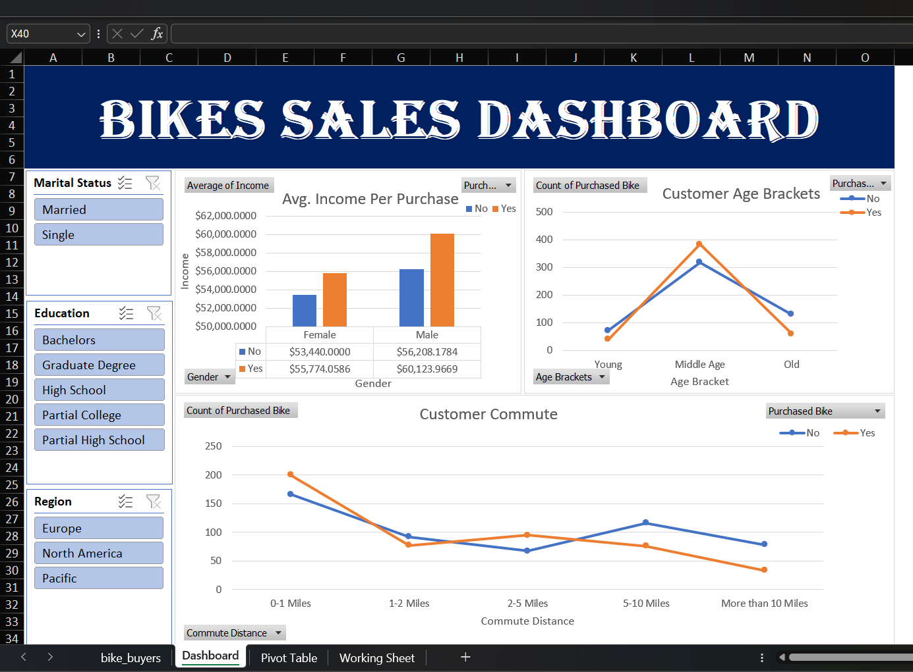

# Bike Sales Interactive Dashboard 🚲

## Project Overview
This project analyzes customer demographic data to identify key factors that influence bike purchasing decisions. Using Excel, I transformed raw consumer data into an interactive dashboard that allows stakeholders to filter results by region, education, and marital status.

## Dashboard Preview

## Key Insights
* **Income Influence:** On average, male customers who purchased bikes had a higher income (~$60k) compared to those who didn't.
* **Commute Impact:** Customers with a commute distance of 0-1 miles are the most likely to purchase a bike.
* **Age Demographics:** "Middle Age" individuals (31-54) represent the largest segment of bike buyers, significantly outperforming "Young" and "Old" age brackets.

## Workflow & Skills
### 1. Data Cleaning (Working Sheet)
- **Duplicate Removal:** Cleaned 1,000+ rows of customer data.
- **Find & Replace:** Standardized 'M' to 'Married', 'S' to 'Single', 'F' to 'Female', and 'M' to 'Male' for better readability.
- **Nested IF Statements:** Created an 'Age Brackets' column to categorize customers into Young, Middle Age, and Old.

### 2. Data Analysis (Pivot Tables)
- Built multiple pivot tables to aggregate data on:
  - Average Income per purchase (Gender-wise).
  - Customer Age Brackets.
  - Commute Distance trends.

### 3. Data Visualization (Dashboard)
- Developed an interactive dashboard utilizing:
  - **Bar and Line Charts** for trend visualization.
  - **Slicers** for dynamic filtering by Marital Status, Region, and Education.

## Tools Used
- **Microsoft Excel:** Advanced Formulas, Power Query (Data Cleaning), Pivot Tables, and Interactive Dashboards.
