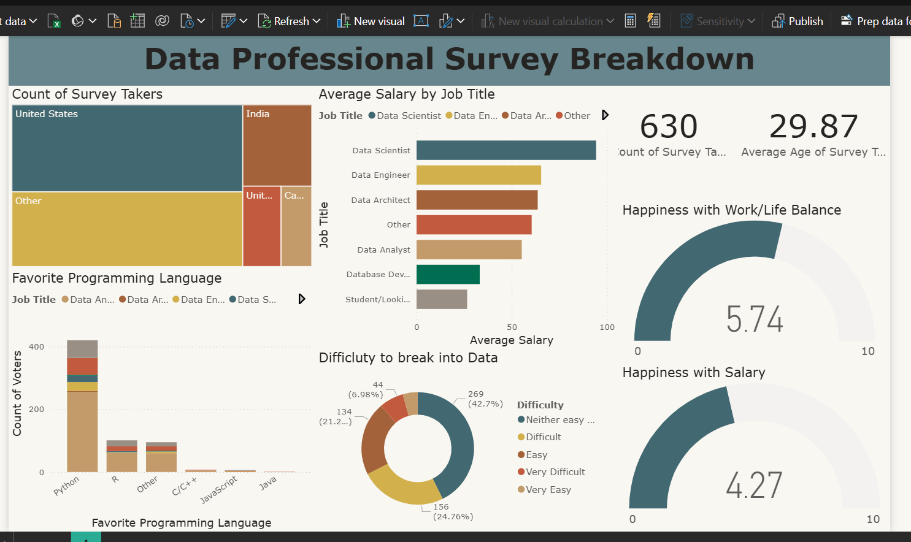

# Data Professional Survey Dashboard (Power BI) 📊

## Project Overview
This project analyzes a global survey of 600+ data professionals to uncover trends in compensation, job satisfaction, and the technical landscape of the industry. The dashboard provides an interactive way to explore how job titles, programming languages, and geography impact a professional's career path.

## Dashboard Preview

## Key Insights from the Analysis
* **Salary Benchmarks:** Data Scientists and Architects dominate the top salary brackets, while Data Analysts show the highest volume of entry-level opportunities.
* **Tech Preference:** Python is the most popular programming language across all data roles, followed by R and SQL.
* **Geography:** The United States and India represent the largest clusters of survey respondents, with significant salary variance between regions.
* **Work-Life Balance:** Using Gauge visuals, the data shows an average satisfaction score of 5.74/10 for Work-Life Balance and 4.27/10 for Salary satisfaction across the industry.

## Technical Skills Demonstrated
### 1. Data Transformation (Power Query)
- **Cleaning:** Handled "Other" category responses and standardized inconsistent job titles.
- **DAX Measures:** Created calculated measures to find the average age (30) and count of unique respondents (630).
- **Parsing:** Split and formatted salary ranges to create a functional X-axis for distribution charts.

### 2. Data Visualization
- **Treemaps:** Used to show the distribution of job titles (Data Analyst being the most common).
- **Map Integration:** Visualized the global footprint of the data community.
- **Interactive Slicers:** Enabled filtering by Country to see localized salary and satisfaction data.

## Tools Used
- **Power BI Desktop**
- **DAX (Data Analysis Expressions)**
- **Power Query**
