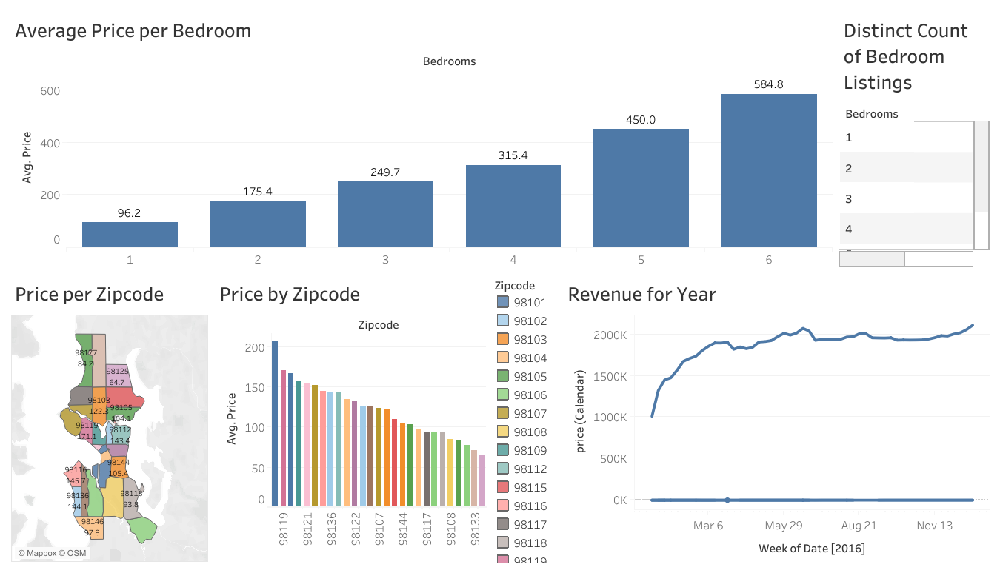

# Seattle Airbnb Market Analysis (Tableau) 🏠📍

## Project Overview
This project provides a data-driven deep dive into the Seattle Airbnb market. By analyzing listing data, I developed an interactive dashboard to help stakeholders understand pricing dynamics, seasonal demand, and location-based performance. This analysis is designed to assist potential hosts in identifying high-value investment zones.

## Live Interactive Dashboard
👉 **[View the Full Interactive Dashboard on Tableau Public](https://public.tableau.com/app/profile/saurav.verma1988/viz/AirBnbProject_17722651551760/Dashboard1)**

## Dashboard Preview

## Key Insights
* **Geospatial Hotspots:** Developed a zip-code level heat map identifying Downtown Seattle as the highest revenue-generating area.
* **Price Seasonality:** Identified a significant pricing peak during the summer months (July/August), correlating with peak tourism seasons.
* **Capacity Analysis:** Analyzed the relationship between bedroom count and average price, providing clarity on the ROI for different property sizes.
* **Volume Distribution:** Mapped the concentration of listings across the city to visualize market saturation.

## Technical Skills Used
- **Data Modeling:** Combined multiple datasets (Listings and Calendar) to create a unified data source for time-series analysis.
- **Geocoding:** Transformed zip-code data into interactive spatial visualizations.
- **Calculated Fields:** Built custom formulas in Tableau to aggregate average prices and listing counts dynamically.
- **Visual Storytelling:** Designed a user-centric dashboard with synchronized filters for seamless data exploration.

## Tools Used
- **Tableau Desktop / Tableau Public**
- **Microsoft Excel** (Data preparation and cleaning)
